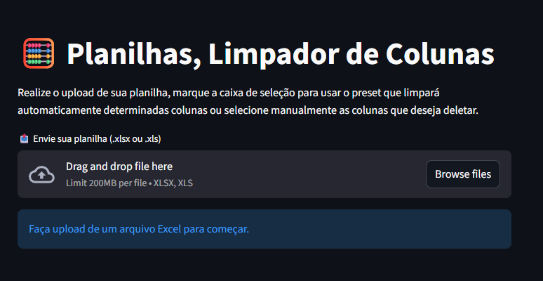

<h1 align="center">🧮 Limpador de colunas para planilhas</h1>

<div align="center">
 

 


</div>


### 💡 Descrição

O script desenvolvido em python juntamente com streamlit visa fazer a manipulação de planilhas, excluindo colunas de forma automática e manual possibilitando a criação de novas planilhas de maneira prática e rápida.

<p align="center">

</p>


### 🚀 Funcionalidades

 - Upload de planilhas `.xlsx` ou `.xls`
 - Remoção automática de colunas com **presets pré-configurados**
 - Opção de **edição manual** das colunas a serem removidas
 - Geração de **3 novas planilhas**:
   - Planilha Original (com colunas removidas)
   - Planilha 1
   - Planilha 2
 - Download único em **arquivo ZIP**
 - Interface moderna e leve feita com Streamlit

### ⚙️ Requisitos

- Python **3.9 ou superior**
- Bibliotecas Python (instalação abaixo)

### 📦 Instalação

1. **Clone o repositório** ou baixe o ZIP
2. Descompacte o arquivo
3. Abra seu terminal e digite o endereço em que a pasta foi extraída:
```bash
cd "C:\Users\SeuUsuario\seu endereço\projeto"
```
4.**Instale as dependências**, no seu terminal digite
```bash
pip install -r requirements.txt
```
5. Execute o projeto com a seguinte linha de comando no terminal:
```bash
streamlit run process_planilhas.py
```
6.Após executar o comando anterior, acesse o projeto no navegador por meio do link que será disponibilizado como esse:

```bash
Local URL: http://localhost:8501
```

### 🚀 Uso
1. Faça o upload da planilha original.
2. Selecione a caixa de marcação para usar o preset e excluir colunas pré-definidas automáticamente.
3. (Opcional) Se quiser, selecione manualmente as colunas que deseja manter ou excluir além daquelas disponíveis pelo preset.
4. Clique em **Gerar Planilhas**.
5. Baixe o arquivo `.zip` contendo as três novas planilhas.


